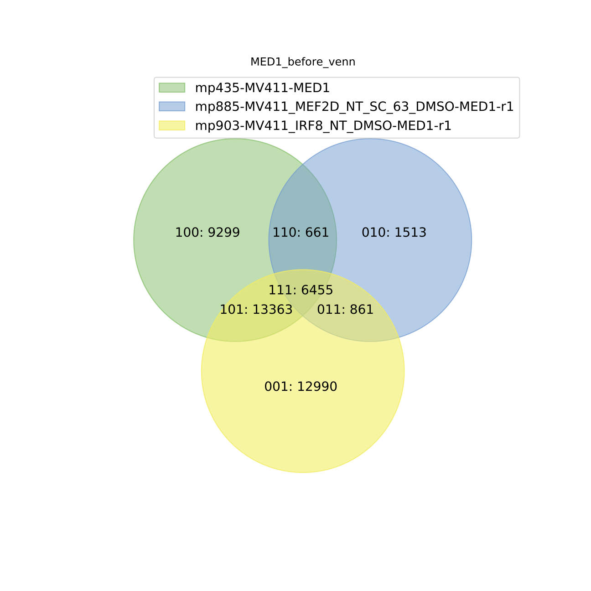
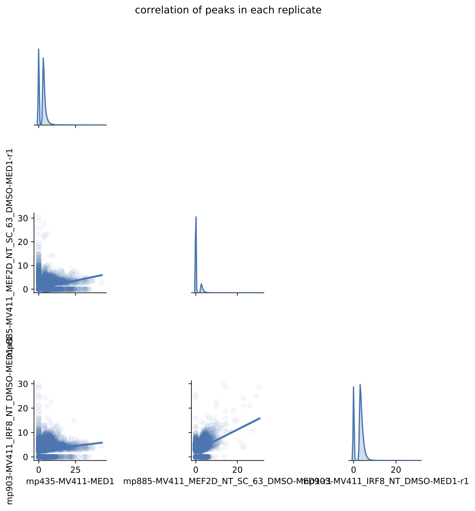
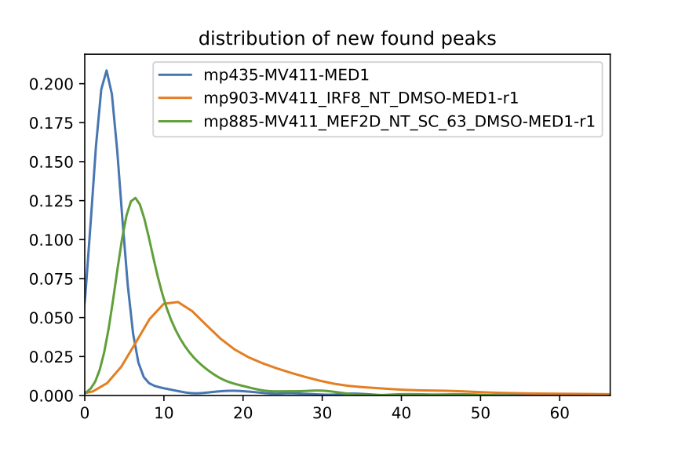

# genepy/CREME: ChIP REplicate MErger

CREME is part of the [genepy](https://github.com/broadinstitute/GenePy) package.

For Introduction we will link to the [article](https://ro-che.info/articles/2018-07-11-chip-seq-consensus) by Roman Cheplyaka on the subject.

We built this tool noticing the lack of publicly available simple Chip Merging tool working for [MACS2](https://github.com/macs3-project/MACS)'s output, with replicates of broadly different quality. We wanted a 1 function tool that would work in python.

We will although note tools such as:
- [PePr](https://pubmed.ncbi.nlm.nih.gov/24894502/) [code](https://github.com/shawnzhangyx/PePr) which can substitute itself from MACS2 by ccalling on mutliple bam files at the same time. It will work by counting reads and looking at the peak shape.
- [multiGPS](https://journals.plos.org/ploscompbiol/article?id=10.1371/journal.pcbi.1003501), [code](https://github.com/seqcode/multigps) which is mostly  for differential binding chipseq but can work with replicates and work in java + R. 
- [MSPC](https://academic.oup.com/bioinformatics/article/31/17/2761/183989), [code](https://github.com/Genometric/MSPC) in .NET, which is very well documented, simple and provide some QC by the user.

- [genoGAM](https://bmcbioinformatics.biomedcentral.com/articles/10.1186/s12859-018-2238-7) in R, [code](https://github.com/gstricker/GenoGAM). Which calls peaks by itself as well and seem to handle replicates.

- [sierra Platinum](https://www.ncbi.nlm.nih.gov/pmc/articles/PMC5025614/), [code](https://github.com/sierraplatinum/sierra), which does not seem to be maintained.

## Our tool

The goal of creme is to be a simple, 1 function tool. It works with 1 to many sets of replicates for each pulled protein/mark.

CREME takes as input a pandas dataframe. This dataframe is the concatenation of each replicates' bed files and can be loaded from a set of MACS2 bedfiles using genepy's loadPeaks function.

CREME will output, amongst other thing, a dataframe representing a concatenation f bedfiles of merged replicates.

## Process

### Selection: Finding the best replicate

A first goal of CREME was to find the best replicate, to do so, it can take manual annotation of _BAD_ (bad/lower quality) replicates. These can be provided by visual inspection of bigwig tracks + bed files on IGV, from thresholding on QC results such as FRiP scores.

Given all available replicates, CREME will compute a conscensus, considering any peaks at most 150 bp from another peak, to be in overlap. We have noticed that changing this parameter from 0 to 150 decreased the total number of peaks found by only 8%.

Non overlapping peaks are kept in the conscensus. When we have an overlap we take the mean of signals and the product of pvalues across overlapping replicates.

Then, CREME will look at their overlap and select the one that has the best overlap score:

$O_{score}(A) = \sum{i from 0 to m} \sum{K in comb(i, G)} i * \sum {j from 0 to n}  AND(A[j],...K[j])$

Where:
- $G$ is a binary matrix of size (row/col) $m*n$ of $m$ replicates with $n$ conscensus peaks and a value of 1 if replicate $m_i$ has peak on conscensus peak $n_i$.
- $comb(i, G)$ is a list of all possible matrices made from taking $i$ elements (row) from matrix $G$ without replacement.
- $AND$ is a binary operation returning 1 if all passed elements are 1 else 0.

The non-bad quality replicate with the best score will be selected as the __main replicate__.

In addition to the venn diagram, correlation between each replicate's peak signal is computed and displayed to the user.

### Validation: Finding new peaks

For each additional replicate S, we will now look for new peaks. 
First, if we find that the second best replicate and the first best replicate have both less than 30% of their peaks in common we __discard__ that protein/mark and only return the main replicate.

Taking peaks that are found in the main replicate, we will call peaks, using S's bigwig and a lower threshold than what MACS2 is using by default. We then do the same for peaks in S that were not in the main replicate.

If after calling new peaks we get less than 30% overlap in both replicates, we discard the replicate.

Else, we finalize the merging of overlapping peaks and update the __main replicate__ with this overlap.

### Calling Peaks

The process of calling peaks is loosely based on MACS2's peak calling algorithm:

We compute a distance: the [KL divergence](https://en.wikipedia.org/wiki/Kullback%E2%80%93Leibler_divergence), between two poisson distributions. One is representing the distribution of signal from a bigwig file under a region. The other is the representing the same signal under the entire chromosome where that region lies. The region here is the peak in the other sample that we want to look for in the current sample.

If that distance is above a threshold: here 8, we validate the region as being a peak.

### Output and QC

The output of our tool is a dataframe of concatenated merged replicates. The pipeline also outputs a set of bad quality replicates and bad quality proteins/marks.

Additionally, inforrmation on distribution of peak signal across replicates and number of peaks found is provided to the user.

## WIP and current issues

1. For now, we are not using the exact same algorithm as MACS2, as we are comparing the peak's read distribution to overall reads in the chromosome using KL divergence. But MACS2 is comparing 4 terms: the distribution in the likely region of the sample BAM, the distribution in the likely region of the INPUT BAM, the distribution in the sample BAM's chromosome, the distribution in the INPUT BAM's chromosome. Moreover, MACS is comparing them using something like a fisher's exact test and corrects for FDR using the BH method.

2. For now, we are not computing a perfect overall replicate quality ourselves. Our  scoring method did not work in 5% of cases. We might want to mitigate it by adding peaks' Qvalues and the replicate's Frip score and total read count in our analysis.

3. For now, we do not compute pvalue when we compute new peaks.

4. For now, we do not integrate the pvalue/ signal of newly found peaks in the conscensus merger.  

5. More long term: We would hope to do something more akin to joint calling across replicates using graphical models to call peaks.
