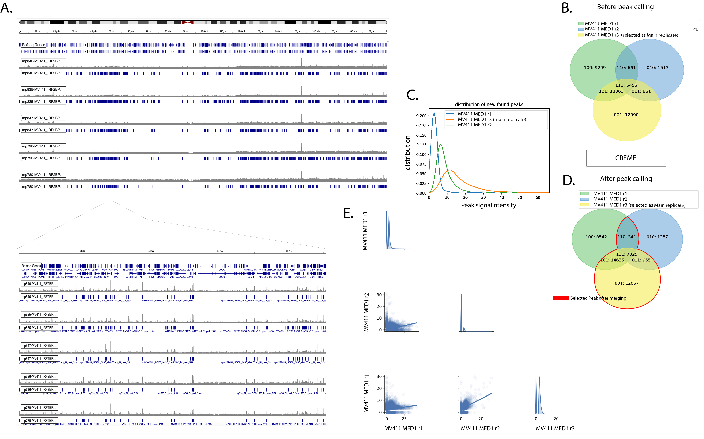

In many ChIP-seq experiments, replicates are available for each sample and require deciding on a consensus procedure to interpret the read count peaks in the sequencing data. Currently, there is a lack of an easy to use, publicly available ChIP Replicate Merging tool (see Roche's [article](https://ro-che.info/articles/2018-07-11-chip-seq-consensus)). Chip REplicate MErger or [CREME](https://github.com/broadinstitute/genepy/blob/master/genepy/epigenetics/CREME.py), is a one-function python tool, part of the [genepy](https://github.com/broadinstitute/GenePy)'s _epigenetics_ package.
CREME works as a fast post processing step to the [MACS2](https://github.com/macs3-project/MACS) peak calling algorithm. It can use replicates across different experiments, labs or sequencing methods and does not need any raw sequencing data.
CREME takes as inputs 1 to many sets of replicates for each pulled protein/mark, as a BED files and bigWig tracks for each (see [figure S17A](#plotA)). It then outputs a merged BED file, as well as merging quality metrics and putative bad quality replicates and proteins/marks.

Given a set of replicates, CREME first computes a consensus by taking the union of all of their peaks and considering any peak at most 150 bp away (using their edges' distance) from another to be in overlap. We have noticed that changing this parameter from 0 to 150 decreased the total number of peaks found by only 8%.
Peaks considered in "overlap" are merged. To merge them we take the mean of their signals, the product of their p-values and their outer edge. (see [genepy's _simpleMergePeaks_ function](https://github.com/broadinstitute/genepy/blob/master/genepy/epigenetics/chipseq.py#L153))

Then, CREME will compute a similarity score (see [figure S17B](#plotB)) by taking the sum of all of that replicates' peak weighted by how many other peak they are in overlap with, according to:

$S_{score}(r) = \sum_{i \in [1...m]} (\sum_{K \in comb(i, G)} (i * \sum_{j \in [0...n]} and(G[r,j],K[0,j],...,K[i,j])))$

Where:
- $G$ is an $m*n$ binary matrix of $m$ replicates with $n$ consensus peaks and a value of 1 if replicate $m_i$ has a peak on consensus peak $n_i$ and 0 otherwise.
- $r$ is one of the replicates.
- $comb(i, G)$ is a list of all possible matrices made from taking $i$ replicates from matrix $G$ without replacement.
- $and()$ is a binary operation returning 1 if all passed elements are 1 else 0.

The highest scoring sample not labelled as _bad-quality_ replicate will be selected as the __main replicate__. Where _bad-quality_ replicates are user provided annotations, e.g. found by visual inspection of bigWig tracks, a threshold on _FRiP_ scores or any other method ([figure S17C](#plotC)).

If we find that the second best scoring replicate and the __main replicate__ have both less than 30% of their peaks in common we mark that protein/mark as __failed__ and only return the __main replicate__.

For each replicate, we will now look for new peaks using a modified MACS2's peak calling algorithm algorithm with a lower discovery threshold: We assume that the peaks are ‘events’ in a Poisson process occurring across the genome. We then compute the difference between the region of interest and its entire chromosome, using the [KL divergence](https://en.wikipedia.org/wiki/Kullback%E2%80%93Leibler_divergence) between two poisson distributions originating from these two regions. The signal for these events are extracted from the bigWig files. If the KL distance is above a threshold (here smaller than MACS2's default), we validate the region as being a peak.
 
Using the above algorithm and the second best replicate (call it __B__) we proceed in 2 steps:
 
1. Taking peak loci in the __main replicate__ not overlapping in __B__, we try to call them under __B__ (using __B__'s bigWig).
2. We then do the same for __B__, taking __B__'s peaks not in overlap with the __main replicate__ and the __main replicate__'s bigWig.
3. If after calling new peaks we get less than 30% overlap in both replicates, we discard the replicate, else we add all the _newly found_ peaks.

We repeat this procedure with __B__ being the 3rd best replicate, then 4th best, etc.

The final merged BED file contains all consensus peaks of the __main replicates__ (including its _newly found_ peaks) and any other peaks if present in at least 2 replicates (see [figure S17D](#plotD)).
The pipeline also outputs a set of putative bad quality replicates and bad quality proteins/marks based on this overlap & peak calling procedure.

We think that CREME can fit as a quick and simple utility for aggregating any set of replicate ChIP-seq, even with a coarse knowledge of their provenance and no raw sequencing data. Additionally we think that CREME is easy to modify and understand and can serve as a basis for any other group trying to merge replicates. We have reliably used it on hundreds of replicates of variable quality, from different sequencing platforms and different labs to improve the quality of our subsequent data discovery pipeline.



- A: An IGV plot of mediator binding across replicates over a random loci in MV411. We can see regions that match and regions that could match, given looser peak calling thresholds.
- B: A venn diagram of the number of overlapping peaks across replicates.
- C: In addition to the venn diagram, correlation between each replicate's peak signals is computed and displayed to the user.
- D: A density plot over the distribution of intensity values of the newfound peaks of each replicate.
- E: Same as _B_ but after calling new peaks in each replicate.

We will note the existence of similar tools such as [PePr](https://pubmed.ncbi.nlm.nih.gov/24894502/), [genoGAM](https://bmcbioinformatics.biomedcentral.com/articles/10.1186/s12859-018-2238-7), [multiGPS](https://journals.plos.org/ploscompbiol/article?id=10.1371/journal.pcbi.1003501), [MSPC](https://academic.oup.com/bioinformatics/article/31/17/2761/183989), [code](https://github.com/Genometric/MSPC), [sierra Platinum](https://www.ncbi.nlm.nih.gov/pmc/articles/PMC5025614/), which are all both more complex, not implemented in python, requiring the raw sequencing data and often difficult to easily use and modify.

CREME's source code is available [here](https://github.com/broadinstitute/genepy/blob/master/genepy/epigenetics/CREME.py). More information about CREME is available in the supplementary material and at our [github](https://github.com/broadinstitute/genepy/blob/master/genepy/epigenetics/CREME.md) explainer readme.

<!--```python
def findNewPeaks(BB, ):
  L[A]

----

def call( L(N,2), B(V)):
  B[L[i,0],L[i,1]]


------>
